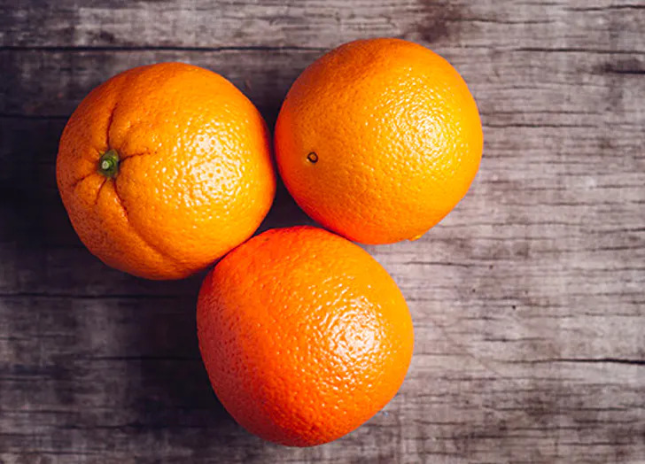

+++
title =  "Big Orange 🍊"
date =  2022-06-22
[taxonomies]
tags =  ["Random"]
[extra]
summary =  "Idle thoughts about the fruit"
image = "bigorange-feature.jpg"
+++

I like big oranges. Navel or winter or Jaffa or  whatever they're called at various points of the year. They're always  big. Bigger than clementines or satsumas (what is the difference?) or  other citrus fruit of that colour but which are smaller. They're  satisfying to eat, they fill you up somewhat, generally juicy, and a  good size. They can be a pudding or a snack and you're not looking  around for another or something else. An all round good fruit.

One thing that I've found over the years of eating big oranges in public,  is that not many people like big oranges. I'm surprised by this, given  all the reasons I've stated why big oranges are good. What's also  surprising, but equally surprisingly common, is that people will comment about how the orange looks nice but state that they'd never eat one.  They stand there and watch me take it out my bag or pick it up from its  resting place on my desk and begin the peeling process. Maybe they  mutter it, maybe they say it clear as day, or maybe they just think it,  but it's always the same: "I'd never eat a big orange".

Now is a  good time to talk about the process of peeling a big orange. I think  this is important as I think this is one of the main reasons why people  don't like eating big oranges. I could be wrong as I've never challenged people to why they'd never eat a big orange, out of respect of their  life choices, but I reckon the peeling plus one other item is why.

The peeling process does depend on the type of orange. (I'm aware of Homer  Simpson taking a marriage class, whilst Hans Moleman takes an orange  eating class in a classic episode of The Simpson's (S5E22 if you must  know)).

Anyway, if the  skin is thick then it's typically very easy to peel. A single peel is  very achievable, even by the most novice of big orange eater. If the  skin is thin then it can be slow going, especially if you get into the  pick off tiny pieces mode. I recommend just skipping straight to the  knife and cutting it into segments if you find yourself in this  situation.

Start by rolling it around in your hands, then  alternative squeezing it with your thumbs. You're trying to "soften it  up" I find it helps relax or even break the bond of the skin to the  segments. However, you don't want to squeeze it too much as you might  burst the cell walls and end up in a messy situation. The next stage is  the first pierce of the skin. I like to find a spot around the Tropic of Cancer - imagine the orange as the Earth with the top that connects to  the tree as the North Pole. You pinch the skin together a little to try  and raise it away from the flesh. Do this with your thumb and index  finger, then pierce the skin with your thumb. You don't need to have big or sharp nails to do this. You need a nail but mine are short and work  just fine. Once you're in, then it's about trying to pull away the skin  without it breaking too soon. You're trying to peel off a reasonable  sized piece first, so that you have a good perimeter of skin in which to attack next. I use my thumb under the skin to separate it and work more of it away from the flesh. Once I have a decent sized piece, maybe 2" / 5 cm diameter piece, then I head up to the North Pole to pull out the  pith stalk that's inside. It has quite a big of friction and if you try  with a too small piece of skin first then you risk breaking the skin  away from the top and having to tackle it again in a harder manner. Once this is done then it's a case of going around the rest of the skin with your thumb underneath and prising away more until it's all done.  Depending on the type of orange the South Pole can be tricker and  generally messier. This is where you might get a belly button looking  part which has lots of tiny segments inside all linked together in  middle segment of a cone shape. Depending on what's there I often find  that leaving the very southern tip still with skin on and then opening  up the orange into two halves makes getting this part out much easier.  It'll generally come away in two pieces on each half. It'll have some  orange on it that you could eat. However, if this is your first time I'd suggest just composting that part with the skin and worry about it  another day.

From there you can just peel off large chunks of  white pith that you probably don't want to eat and then peel each  segment apart from the main group and enjoy. If the segments are torn or some came off with the skin then you just have to improvise and eat as  it comes. This is a situation which I can very clearly see why some  people would be put off. That brings us nicely to the second main reason why people don't eat big oranges:

### The Mess 😱

This is  particularly important when you're not at home in the comfort of your  own kitchen or shower. This is where people at work look at you  dumbfounded. The risk you've introduced into the workplace by bringing,  peeling and then eating a big orange when you never quite know the  outcome of the peeling is, in many people's view, unacceptable. The only credible mitigation that they'd accept is not eating the orange in the  first place. Elimination, as the highest tier of risk mitigation  strategy, is all they'd consider. This is where I feel they're missing  out. With great risk, comes great reward. That is not to say that I'll  risk it all, but with proper procedures and a competent operator, anyone can enjoy the fruits of a big orange.

But I understand. You don't want orange juice on your hands, or face, or trousers or clothes or  wherever, it's messy, sticky, and ruins your look. Again, follow the  process and you can be safe. If you're really worried, find a sink and  peel and eat the orange over it. Probably you want to practice this at  home as you might get even more comments than merely eating a big orange in the first place. You can then direct any stray juice into the sink  and wash your hands afterwards.

So I hope you can join me in the pleasure of eating a big orange wherever you may please and stand out amongst your peers.

🧡🧡🧡

> If I wanted to see a man eating an orange, I would've taken the orange-eating class! 
> — <cite>Ground's Keeper Willie 🍊</cite>
