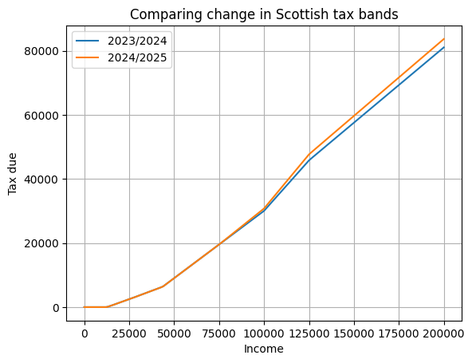
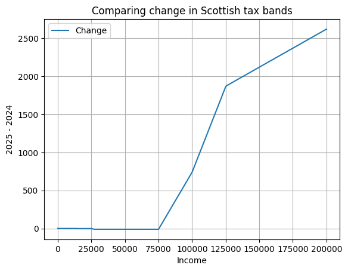
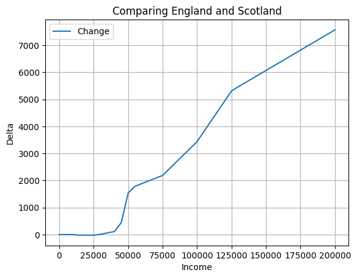

+++
title =  "Changes to the Scottish Tax Bands"
date =  2024-02-05
[taxonomies]
tags =  ["Python", "Finance"]
[extra]
summary =  "This ain't no temporary refund adjustment"
image = "ai-thumb.jpg"
+++

## Introduction

Scotland's government has decided that from next year (from a tax perspective) they'll be adding *another* tax band to Scotland. A 45 per cent income tax band for earnings between £75,000 and £125,140. Plus fiddling with the ranges and percentages of the other bands.

So from the 6th April 2024 these will be the rates:

| **Bands**          | **Band name** | **Rate** |
|--------------------|---------------|----------|
| £12,571 - £14,876  | Starter       | 19%      |
| £14,877 - £26,561  | Basic         | 20%      |
| £26,562 - £43,662  | Intermediate  | 21%      |
| £43,663 - £74,999  | Higher        | 42%      |
| £75,000 - £125,140 | Advanced      | 45%      |
| Above £125,140     | Top           | 48%      |

The current ones are:

| **Bands**          | **Band name** | **Rate** |
|--------------------|---------------|----------|
| £12,571 - £14,732  | Starter       | 19%      |
| £14,733 - £25,688  | Basic         | 20%      |
| £25,689 - £43,662  | Intermediate  | 21%      |
| £75,000 - £125,140 | Higher        | 42%      |
| Above £125,140     | Top           | 47%      |

The personal allowance (0%) remains the same at £12,570 (regardless of inflation, **cough** stealth tax **cough**) and the reduction of this between £100,000 to £125,140 by £1 for every £2.

I'm in the process of making myself a financial forecasting tool to figure out how much I should split between my ISA and pension, in the naive attempt to be financially independent by the time I'm 50. The first part of that was making a function to calculate income tax, and whilst I was making it, I thought it might be interesting to see how these income tax changes impact everyone's salary, from £0 to £200k.

For the record, here's England's tax bands:

| **Bands**          | **Band name** | **Rate** |
|--------------------|---------------|----------|
| £12,571 - £50,720  | Basic         | 20%      |
| £50,271 - £125,140 | Higher        | 40%      |
| Above £125,140     | Additional    | 45%      |

## The Code

The personal allowance is a funny thing, and took me a while to figure out how to calculate it correctly. Working this out is not a new problem so I looked on Github and it seemed people either did a whole load of `if` statements or some clever but unintelligible (by me at least) [numpy matrix math](https://github.com/HJEGeorge/tax_calculator/blob/master/tax_tools.py#L178).

The best way I found to understand it and calculate it such that I could pass various bands and percentages, was to remove the personal allowance from your income and the tax bands that were under £100k, in something that looks like this:

```python
def calculate_scottish_income_tax(income, bands, rates, allowance=12570):


    # Initialize tax and income variables
    personal_allowance = calc_personal_allowance(income)
    tax_due = 0
    remaining_income = income - personal_allowance

    post_pa_bands = [item - (allowance - personal_allowance) if item < 125140 else item for item in bands]

    # Calculate tax for each band
    for i in range(len(bands)):
        if remaining_income <= 0:
            break

        # Determine the taxable amount in the current band
        taxable_amount = min(remaining_income, post_pa_bands[i+1] - post_pa_bands[i])

        # Calculate tax for the current band
        tax_due += taxable_amount * rates[i]

        # Update remaining income
        remaining_income -= taxable_amount

    return tax_due
```

I'd also created a function to determine the personal allowance:

```python
def calc_personal_allowance(income, allowance=12570, threshold=100000):
  return min(allowance, max(allowance-(income-threshold)/2,0))
```

My function takes a list of the bands and percentages. As I couldn't think of another way to do it whilst keeping it simple I just add a trillion pounds to the upper end of the bands. A trillion isn't entirely necessary, but I figured it should cover most of the population.

```python
bands_23_24 = [12570, 14732, 25688, 43662, 125140, 1e9]
rates_23_24 = [0.19, 0.20, 0.21, 0.42, 0.47]

bands_24_25 = [12570, 14876, 26561, 43662, 75000, 125140, 1e9]
rates_24_25 = [0.19, 0.20, 0.21, 0.42, 0.45, 0.48]
```

Let's do a few tests:

```python
income = 100000

tax_2324 = calculate_scottish_income_tax(income, bands_23_24, rates_23_24)
tax_2425 = calculate_scottish_income_tax(income, bands_24_25, rates_24_25)

print(f"Income of £{income} paid £{tax_2324} last year and £{tax_2425} this year")
```

```
Income of £100000 paid £30038.48 last year and £30778.309999999998 this year
```

Well, it's gone up, but what about everyone else?

## Results

Time to see what's happened across the spectrum for 99.9999% of the population.

```python
x_values = np.arange(0, 200001, 1000)

df = pd.DataFrame({'Income': x_values})
df['Tax 2023/2024'] = df['Income'].apply(lambda x: calculate_scottish_income_tax(x, bands_23_24, rates_23_24))
df['Tax 2024/2025'] = df['Income'].apply(lambda x: calculate_scottish_income_tax(x, bands_24_25, rates_24_25))
df['Change'] = df['Tax 2024/2025'] - df['Tax 2023/2024']
df = df.round(2)
```



Obviously above £75k it has changed, but actually at the lower amounts it has changed too. Generally, slightly better as the band ranges have changed. Although if you earn £15k a year, I'm not sure how much you'll notice the £1.44 extra, given the double digit inflation and Brexit consequences.

Check out that steep gradient between £100k and £125k, the loss of the personal allowance makes it a very high marginal rate of tax.

Let's just have a look at the change between them to make it more obvious.



The [median earnings in Scotland](https://digitalpublications.parliament.scot/ResearchBriefings/Report/2023/2/27/e0888682-8f9a-46f0-9448-5a588c583f58) is £27,710, so how does that person fair? Well as I've already alluded to, they are better off...by £10.17 a year. (Final tax home pay will of course depend on lots of things, including national insurance, which I've not got to yet).

## Conclusion

Without getting too political, there are the numbers. Make of it what you will. Here's England vs. the new Scottish bands.



The graph doesn't win awards for comprehension, so the hint is, Scotland costs more. 🏴󠁧󠁢󠁳󠁣󠁴󠁿
